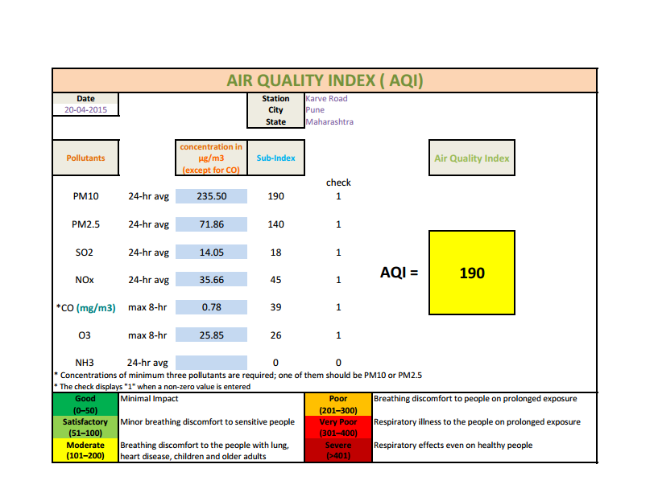
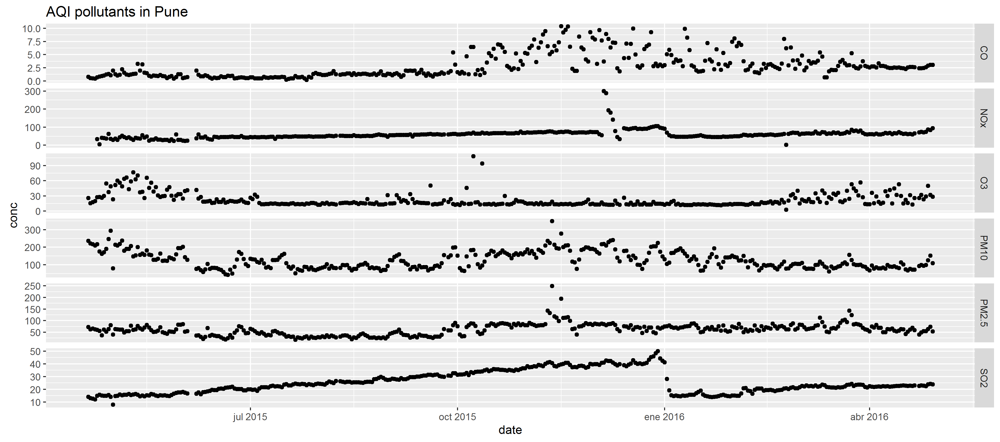

# aqi_pdf

In this repo I want to get *air quality data from the Maharashtra Pollution Control Board* for Mumbai, Pune, Solapur and Chandrapur.

I wanted to grab all data from [this pdf](http://mpcb.gov.in/envtdata/pdf/Pune_Karve_Road.pdf) with a code that I could re-use for the 3 other pdfs [here](http://mpcb.gov.in/envtdata/RegionReport.php), and also when the data gets updated. Apart from one page, in this pdf each page contains a table with concentrations and AQI for the Indian AQI pollutants. There is one table per day, therefore only one concentration/AQI per day.
See the example table below.

For scraping the pdf I used the [tabulizer R package](https://github.com/leeper/tabulizer). So I got from the pdf to a table of all data with [minimal effort](extract_aqi.R). Thanks, Thomas !

Note that

* since March these four stations (Mumbai, Pune, Solapur and Chandrapur) are included in the OpenAQ platform so you can get the concentrations using the [ropenaq package](https://github.com/ropenscilabs/ropenaq), with a finer temporal resolution.

* for more historical values, one could use data from [here](http://mpcb.gov.in/envtdata/envtair.php) but e.g. PM2.5 is not included.
